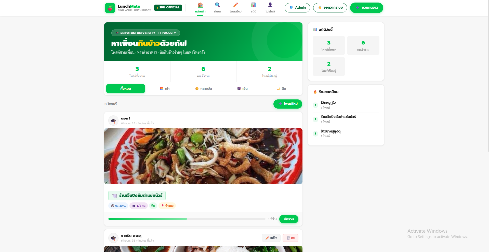

# 🍜 LunchMate — หาเพื่อนกินข้าว

ระบบเว็บแอปพลิเคชันสำหรับนักศึกษามหาวิทยาลัยศรีปทุม ใช้โพสต์ชวนเพื่อนกินข้าว หารค่าอาหาร และนัดกินข้าวได้ง่ายๆ

> **ICT12367** — การใช้กรอบงานสำหรับการพัฒนาเว็บแอปพลิเคชันเพื่อความมั่นคงปลอดภัย  
> คณะเทคโนโลยีสารสนเทศ มหาวิทยาลัยศรีปทุม

---

## 👥 สมาชิกกลุ่ม

| ชื่อ | รหัสนักศึกษา |
|------|--------------|
| ชาคริต พละสุ | 68082679 |
| ชนาเมธ แก้วทนง | 68050906 |

---

## ✨ ฟีเจอร์หลัก

- **โพสต์ชวนกินข้าว** — ระบุร้าน, เวลา, จำนวนที่นั่ง, พื้นที่
- **เข้าร่วมโพสต์** — กดเข้าร่วมได้ทันที มี progress bar แสดงที่ว่าง
- **ค้นหา** — ค้นหาได้ 3 เงื่อนไข: ชื่อร้าน, มื้ออาหาร, พื้นที่
- **โปรไฟล์** — ตั้งชื่อที่แสดงในโพสต์และรูปโปรไฟล์ได้
- **สถิติ** — ดูสถิติโพสต์และร้านยอดนิยม
- **Admin Panel** — จัดการข้อมูลผ่าน Django Admin

---

## 🛠️ เทคโนโลยีที่ใช้

- **Backend**: Python 3.10, Django 4.2
- **Database**: SQLite3
- **Frontend**: HTML, CSS (Custom), JavaScript
- **Font**: Prompt, Sarabun (Google Fonts)

---

## ⚙️ การติดตั้ง

### 1. Clone โปรเจค
```bash
git clone https://github.com/<your-username>/lunchmate.git
cd lunchmate
```

### 2. สร้าง Virtual Environment
```bash
python -m venv venv

# Windows
venv\Scripts\activate

# Mac/Linux
source venv/bin/activate
```

### 3. ติดตั้ง Dependencies
```bash
pip install django pillow
```

### 4. ตั้งค่าฐานข้อมูล
```bash
python manage.py makemigrations
python manage.py migrate
```

### 5. สร้าง Superuser (สำหรับเข้า Admin)
```bash
python manage.py createsuperuser
```

### 6. รันเซิร์ฟเวอร์
```bash
python manage.py runserver
```

เปิดเบราว์เซอร์ที่ `http://127.0.0.1:8000`

---

## 📁 โครงสร้างโปรเจค

```
lunchmate/
├── lunchmate/          # Project settings
│   ├── settings.py
│   ├── urls.py
│   └── wsgi.py
├── posts/              # Main app
│   ├── migrations/
│   ├── static/posts/
│   │   └── style.css
│   ├── templates/posts/
│   │   ├── base.html
│   │   ├── feed.html
│   │   ├── search.html
│   │   ├── form.html
│   │   ├── profile.html
│   │   ├── stats.html
│   │   ├── login.html
│   │   ├── register.html
│   │   └── confirm_delete.html
│   ├── admin.py
│   ├── forms.py
│   ├── models.py
│   ├── urls.py
│   └── views.py
├── media/              # รูปภาพที่ upload
├── db.sqlite3
└── manage.py
```

---

## 🗄️ โมเดลฐานข้อมูล

### LunchPost
| Field | Type | คำอธิบาย |
|-------|------|-----------|
| owner | ForeignKey | เจ้าของโพสต์ |
| name | CharField | ชื่อผู้โพสต์ |
| restaurant | CharField | ชื่อร้านอาหาร |
| area | CharField | พื้นที่/สถานที่ |
| meal | CharField | มื้ออาหาร (เช้า/กลางวัน/เย็น/ดึก) |
| time | CharField | เวลานัด |
| slots | IntegerField | จำนวนที่นั่งทั้งหมด |
| joined | IntegerField | จำนวนคนที่เข้าร่วมแล้ว |
| note | TextField | หมายเหตุเพิ่มเติม |
| image | ImageField | รูปภาพประกอบ |
| created_at | DateTimeField | วันเวลาที่โพสต์ |

### Profile
| Field | Type | คำอธิบาย |
|-------|------|-----------|
| user | OneToOneField | ผู้ใช้งาน |
| display_name | CharField | ชื่อที่แสดงในโพสต์ |
| avatar | ImageField | รูปโปรไฟล์ |
| bio | TextField | แนะนำตัว |

---

## 🖥️ หน้าเว็บไซต์

| URL | หน้า |
|-----|------|
| `/` | หน้าหลัก (Feed) |
| `/search/` | ค้นหาโพสต์ |
| `/post/new/` | สร้างโพสต์ใหม่ |
| `/stats/` | สถิติ |
| `/profile/` | โปรไฟล์ |
| `/register/` | สมัครสมาชิก |
| `/login/` | เข้าสู่ระบบ |
| `/admin/` | Admin Panel |

---

## 📸 หน้าเว็บไซต์

